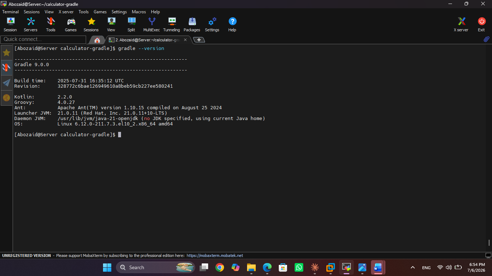
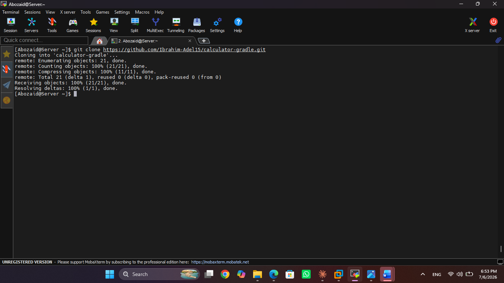
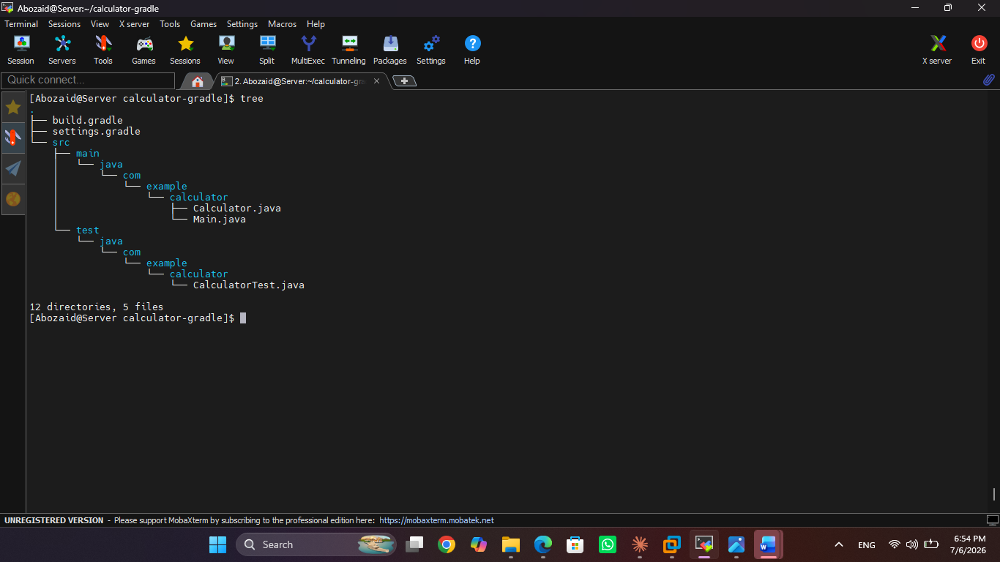
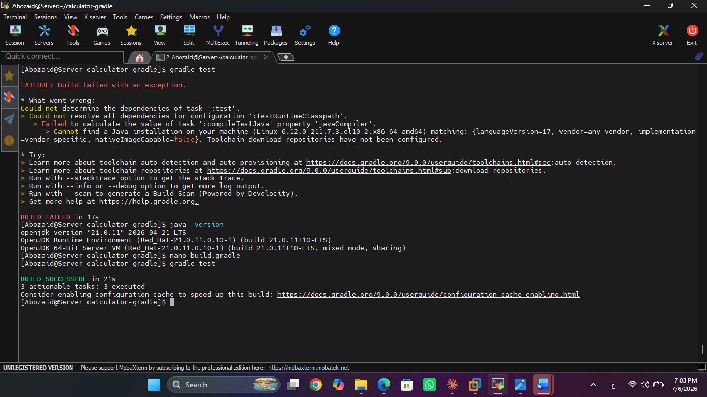
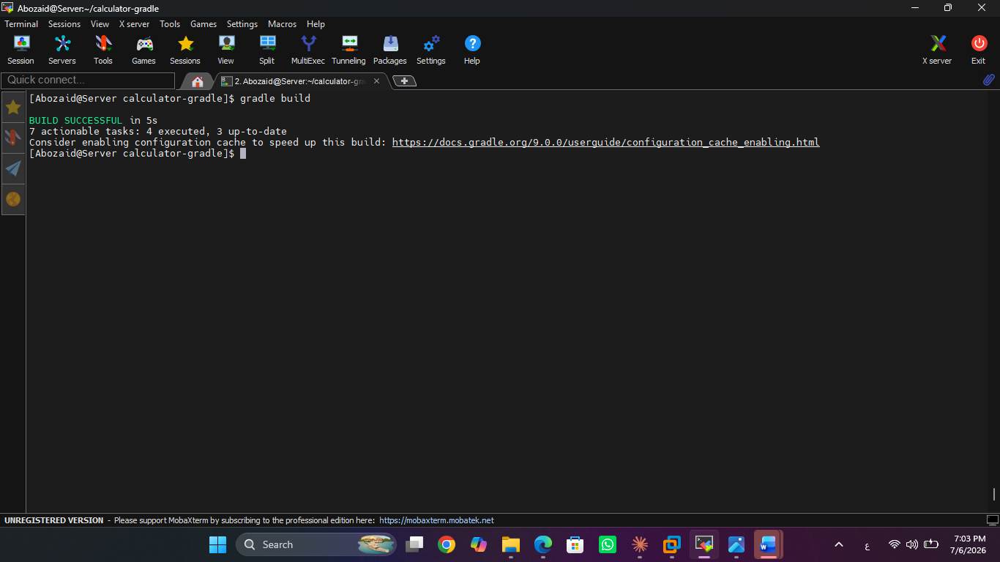
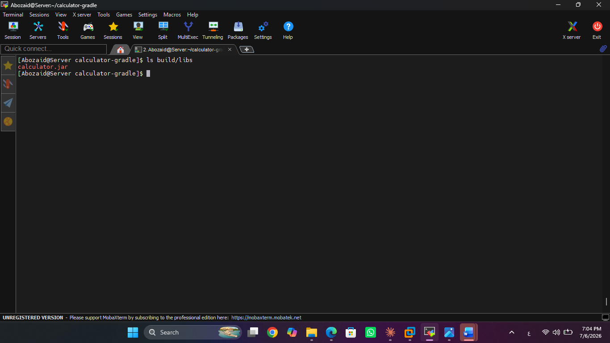
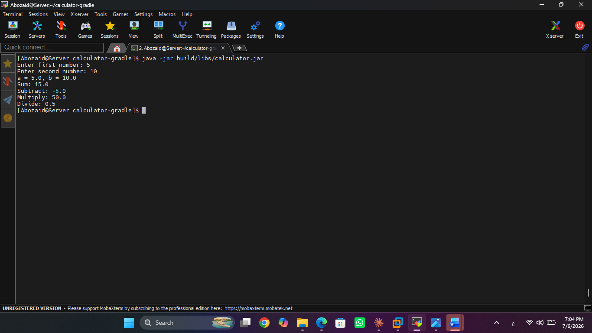

# Lab 1 - Build Java Application with Gradle

## Objective

Build, test, package, and run a Java application using Gradle.

---

## Prerequisites

- Java 21
- Gradle

---

## Step 1 - Verify Gradle

```bash
gradle --version
```



---

## Step 2 - Clone Repository

```bash
git clone https://github.com/Ibrahim-Adel15/calculator-gradle.git
cd calculator-gradle
```



---

## Step 3 - View Project Structure

```bash
tree
```



---

## Step 4 - Run Unit Tests

```bash
gradle test
```



---

## Step 5 - Build the Project

```bash
gradle build
```



---

## Step 6 - Verify Generated JAR

```bash
ls build/libs
```



---

## Step 7 - Run the Application

```bash
java -jar build/libs/calculator.jar
```


