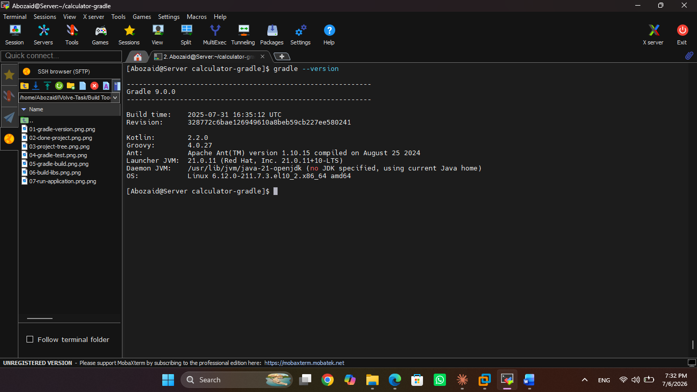
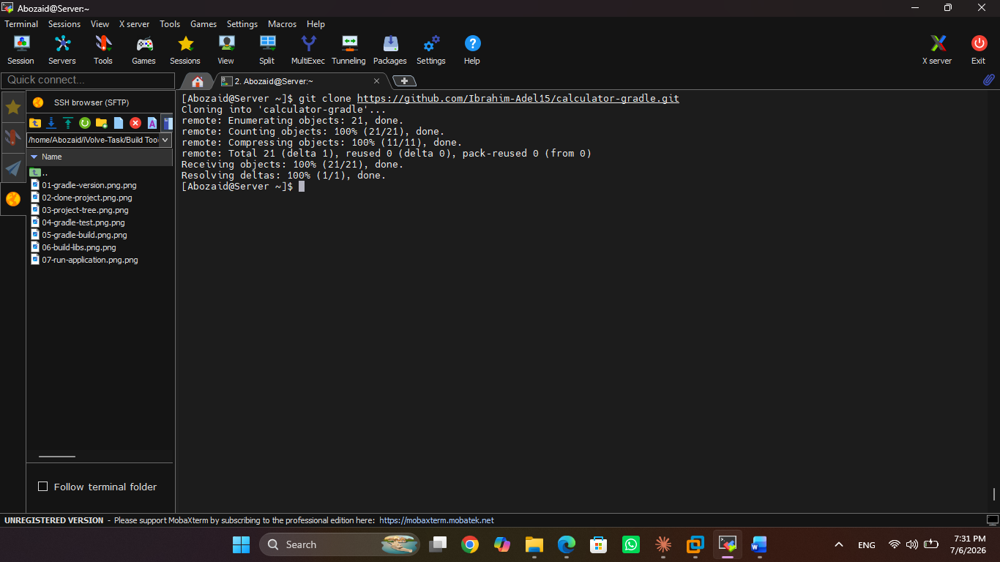
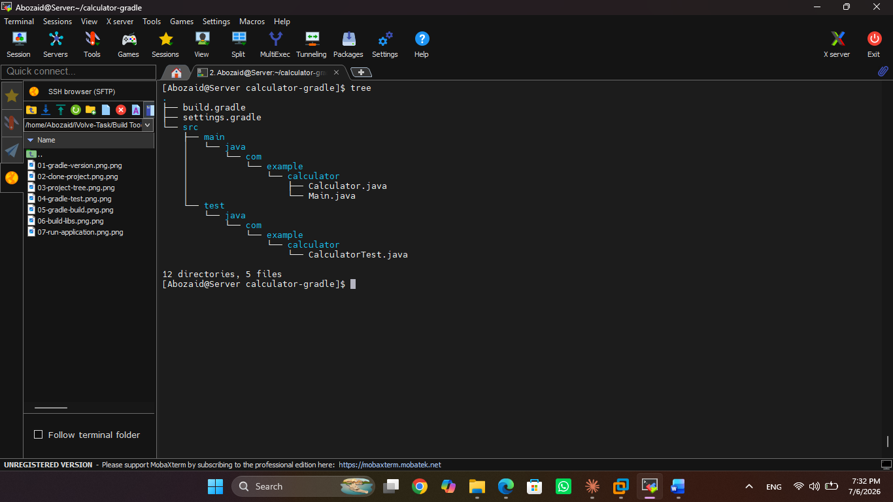
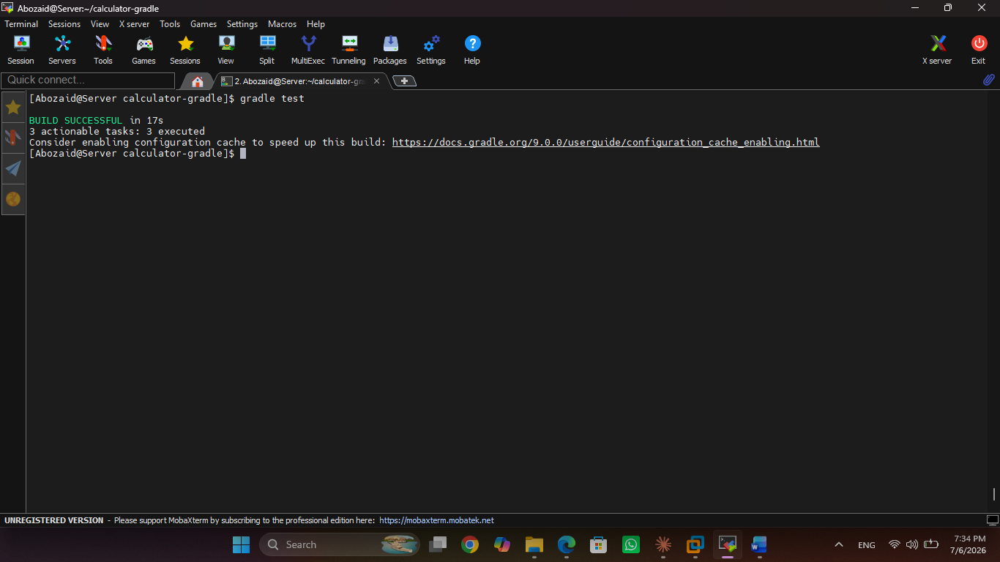
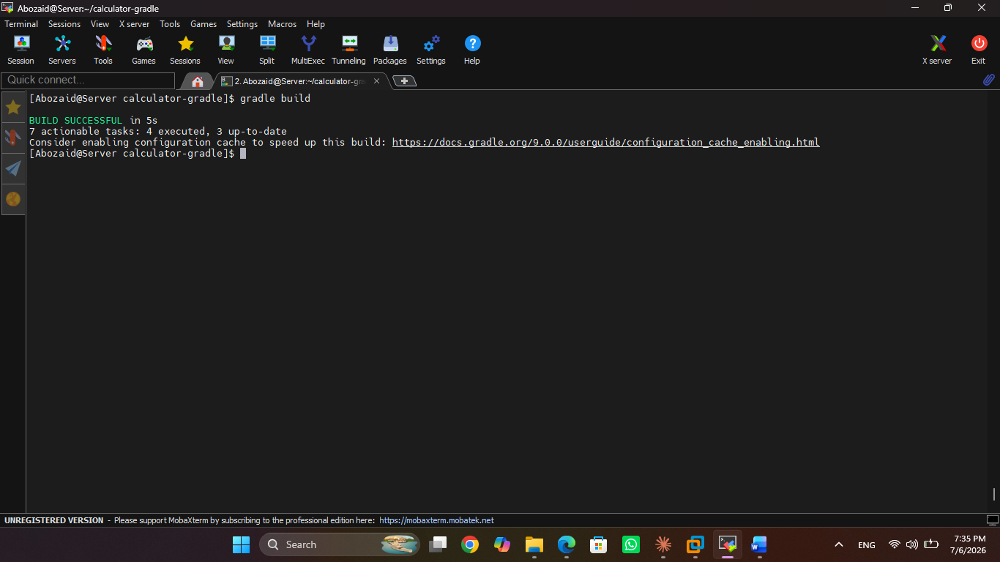
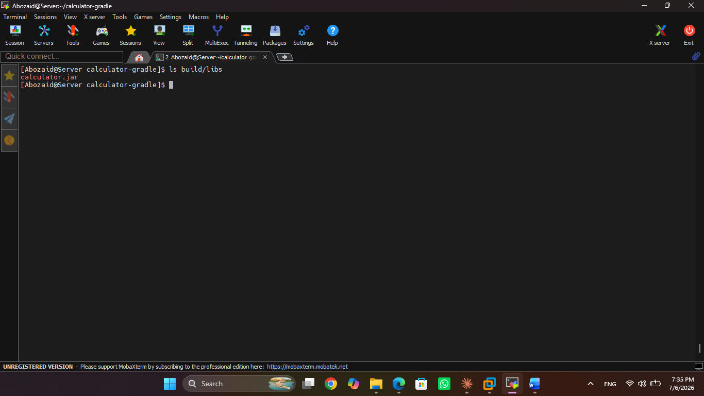
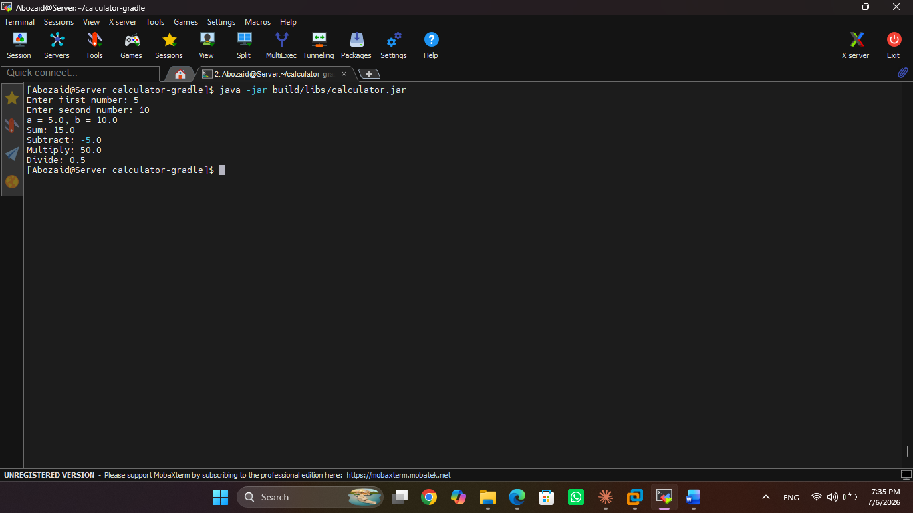

# Lab 2 - Build Java Application with Maven

## Objective

Build, test, package, and run a Java application using Maven.

---

## Prerequisites

- Java 21
- Maven

---

## Step 1 - Verify Maven

```bash
mvn --version
```



---

## Step 2 - Clone Repository

```bash
git clone https://github.com/Ibrahim-Adel15/calculator-maven.git
cd calculator-maven
```



---

## Step 3 - View Project Structure

```bash
tree
```



---

## Step 4 - Run Unit Tests

```bash
mvn test
```



---

## Step 5 - Build the Project

```bash
mvn clean package
```



---

## Step 6 - Verify Generated JAR

```bash
ls target
```



---

## Step 7 - Run the Application

```bash
java -jar target/calculator.jar
```


